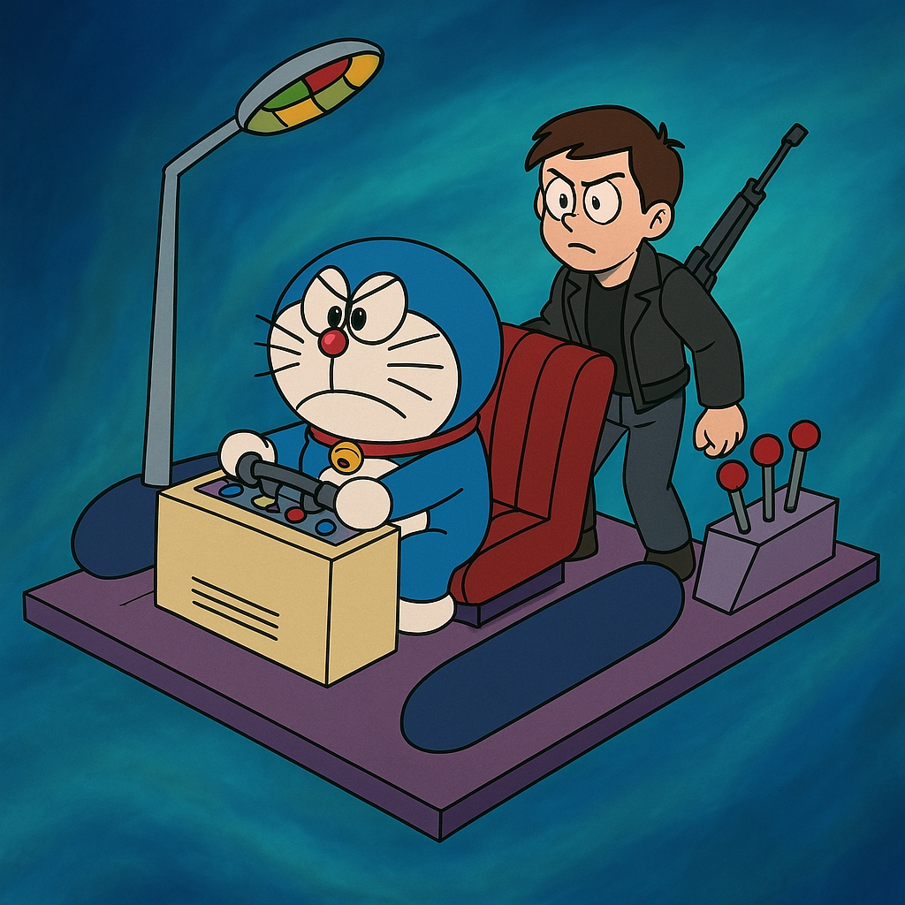
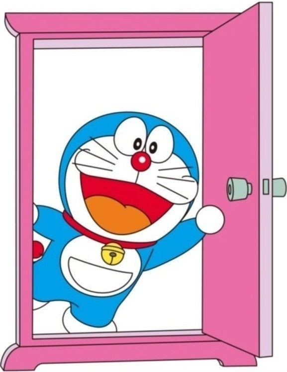
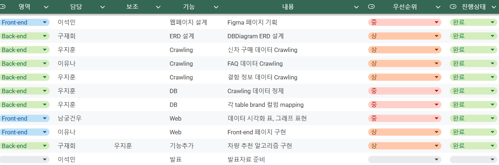
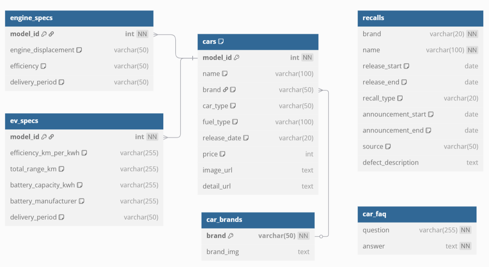
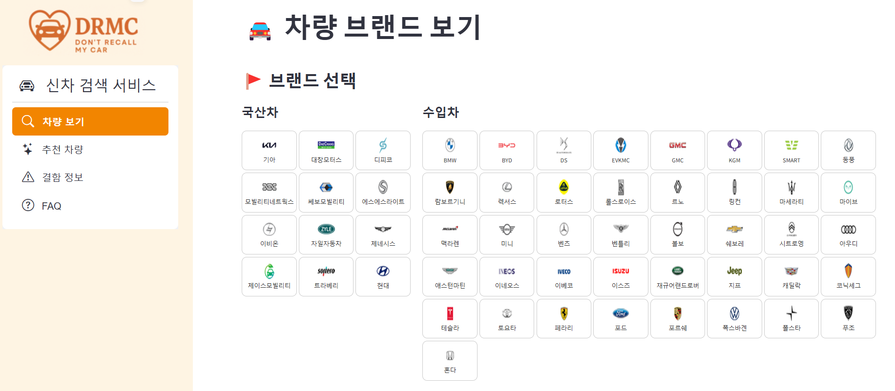
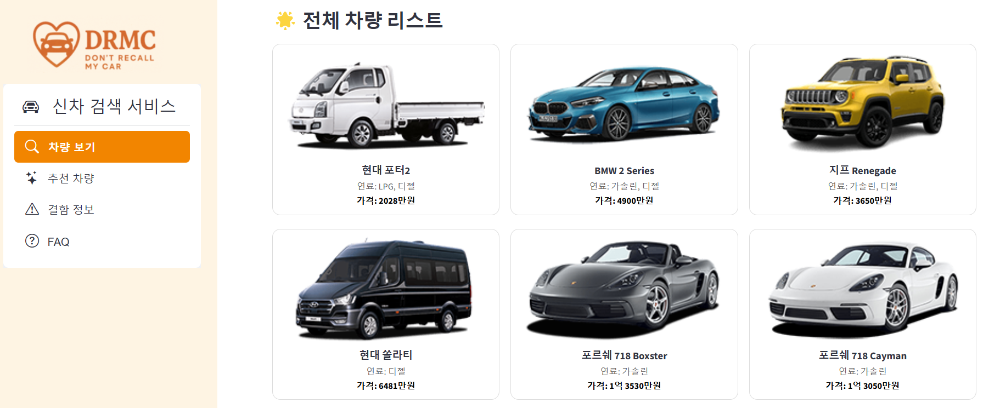
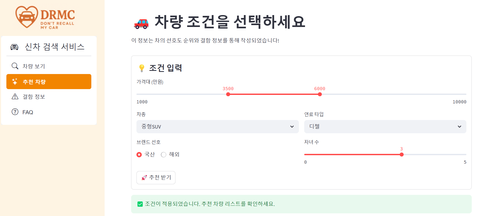
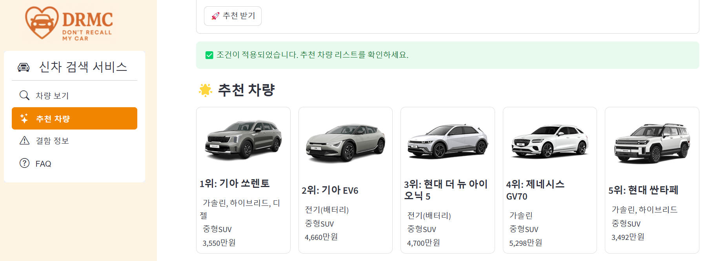

# SKN13-1st-2Team
  - ### SK 네트웍스 AI과정 1차 프로젝트
 
 
    

### 👋 DRMC(Don't Recall My Car)조 팀원소개
  - #### 팀원명 소개 : “자동차 리콜이 너무 많아? 내 차는 제발 리콜되지 않길!”

<table>
  <tr>
    <td align="center">
      
      <b>구재회</b> 
      
    </td>
    <td align="center">
      
      <b>남궁건우</b> 
      
    </td>
    <td align="center">
      
      <b>우지훈</b> 
      
    <td align="center">
      
      <b>이유나</b> 
      
    <td align="center">
      
      <b>이석민</b> 
      
    </td>
  </tr>
</table>

 
 
 

### 🗓️ 개발기간
  #### 2025.04.09 ~ 2025.04.10 (총 2일)
  
 

### 💁‍♀️ 프로젝트 소개 

   #### "결함도 정보다 – 자유로운 선택의 시대" 
  #### 저희팀은 진실을 있는 그대로 보여주는 투명한 자동차 구매 사이트를 만들었습니다.
  #### 완벽한 차를 보여주기보다는 있는 그대로의 차량을 투명하게 보여주고, 소비자가 현명한 선택을 할 수 있도록 도와줍니다.

  
 
 

### 📩 프로젝트 목표

   #### 자동차는 고가의 제품이며, 구매 이후 장기간 사용하는 중요한 자산입니다.
  #### 그러나 기존의 자동차 판매 플랫폼은 차량의 장점만을 강조하고, 결함이나 문제점은 숨기거나 축소하는 경향이 있습니다.
  #### 이러한 환경은 자동차 불완전한 정보에 기반한 의사결정을 유도하며, 구매 후 발생하는 문제에 대한 불만과 피해로 이어질 수 있습니다.
  #### 따라서 이 플랫폼은 차량에 존재하는 결함 정보까지 솔직하게 공개합니다.

  #### ✅ 불완전한 정보로 인한 소비자 피해를 줄이기 위해
  #### ✅ 결함도 포함한 투명한 정보 제공이 신뢰를 높이기 때문에
  #### ✅ 정보의 비대칭을 해소하고 공정한 선택을 가능하게 하기 위해
  #### ✅ 자유로운 판단을 통해 소비자가 스스로 책임 있는 결정을 할 수 있도록

  #### 이 프로젝트는 단순히 차량을 파는 것이 아니라, 결함 정보까지 포함된 소비자 중심의 플랫폼을 만드는 것이 목표입니다.

 
 

### 🛠️ 프로젝트 기술스택

<table>
  <tr>
    <td align="left" valign="top">협업</td>
    <td align="left">
      
      
      
    </td>
  </tr>
  <tr>
    <td align="right" valign="top"><b>프론트엔드</b></td>
    <td align="left">
      
      
      
    </td>
  </tr>
  <tr>
    <td align="right" valign="top"><b>백엔드</b></td>
    <td align="left">
      
      
    </td>
  </tr>
</table>

  

 

### 🛜 WBS
 

  

    
    
 
 

### 📜 ERD
 

  

    
 
 

### 📊 데이터 시각화 플렛폼

 
 

  

    
 

  

    
 

  

    
 

  

    

 
 

## 💭 짧은 회고

 
 
 💭 짧은 회고
  - 남궁건우(팀장) : 

  - 구재회 : 짧은 시간 목표한 기능들을 구현하기 위해 ChatGPT을 적극적으로 활용했습니다. 아쉬움도 남지만 5명이 팀이 되어 협업을 하여 무언가 만들어 냈다는 것에 의의를 두고 싶습니다.

  - 우지훈 : 처음 해보는 크롤링이었지만, 혼자서 주소를 타고 들어가 데이터를 긁어오는 모습이 정말 신기했다. MySQL에 맞는 DB와 테이블을 설계해 데이터를 저장하고, 상관관계를 분석하여 리콜 데이터를 전처리 하였다. 특히 리콜 데이터의 모델명을 참조한 브랜드 정제 작업이 가장 까다로웠다. 여기서 멈추지 않고, 크롤링 기능을 활용한 점메추 봇 MK2도 구상 중이다!

  - 이유나 : 정적인 사이트 (html)을 beautiful soup 로 크롤링 해본 적은 있지만 javascript 가 쓰인 html을 크롤링 해본 것은 처음이라 신기했다. 그리고 streamlit의 한계에 많이 힘들었다. streamlit 꾸미기가 너무 힘들어,,,🥹
  - 이석민 : 처음 써보는 프로그램들이 있어서 당황했지만, 팀원들 덕분에 동작하는 구성에 대해 이해 할 수 있었습니다.

