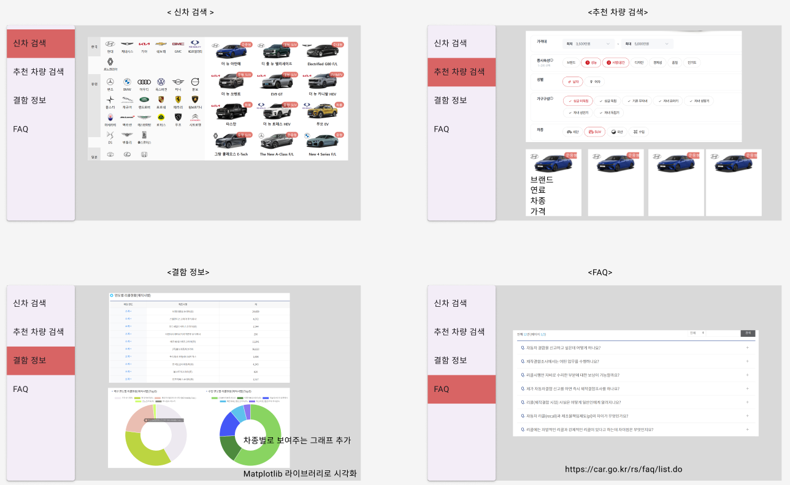
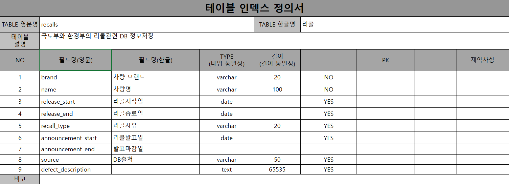
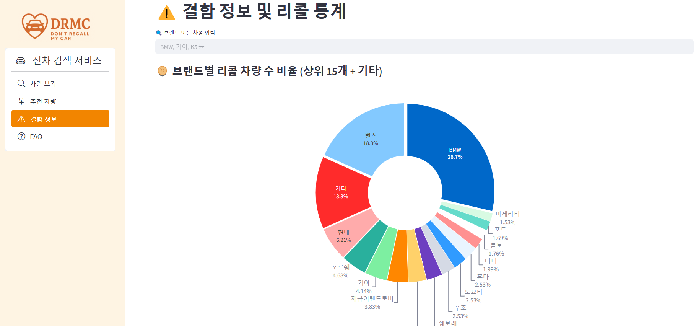
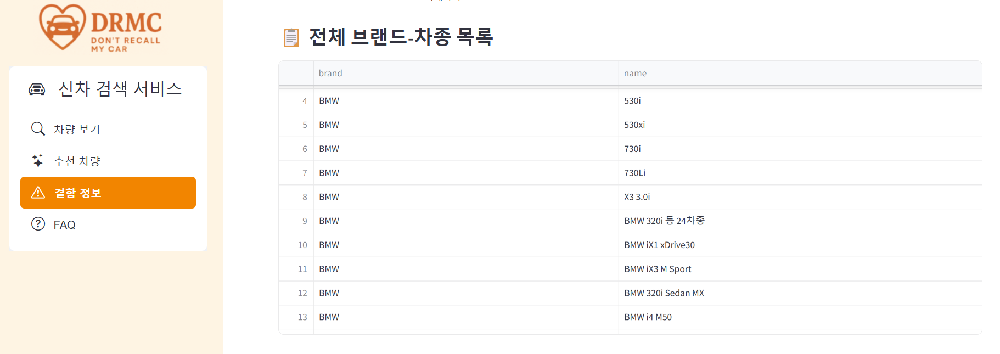
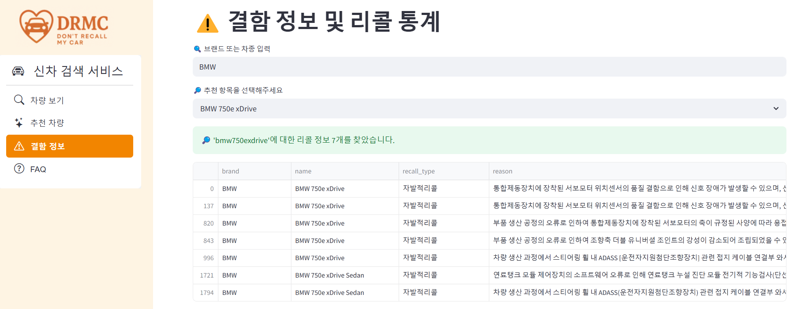
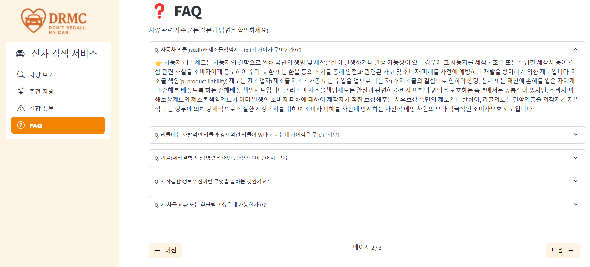

# SKN13-1st-2Team
  - ### SK 네트웍스 AI Camp 1차 프로젝트
 

## 🚀 프로젝트 개요

### 💁‍♀️ 소개

> "결함도 정보다 – 자유로운 선택의 시대"

자동차 정보를 조회하는 자동차 구매 추천 사이트를 만듭니다.
- **자동차 추천**: 구매자의 조건에 맞는 자동차를 추천하고
- **결함 및 리콜 조회**: 자동차의 브랜드, 차종 등을 입력하여 그에 관한 결함 및 리콜 정보를 조회합니다.
자동차의 정보를 있는 그대로 투명하게 보여주고, 소비자가 현명한 선택을 할 수 있도록 도와주는 것을 목표로 합니다.

## 👋 팀원 소개 - DRMC(Don't Recall My Car)
> “자동차 리콜이 너무 많아? 내 차는 제발 리콜되지 않길!”

<table>
  <tr>
    <td align="center">
      
      <b>구재회</b> 
      
    </td>
    <td align="center">
      
      <b>남궁건우</b> 
      
    </td>
    <td align="center">
      
      <b>우지훈</b> 
      
    <td align="center">
      
      <b>이유나</b> 
      
    <td align="center">
      
      <b>이석민</b> 
      
    </td>
  </tr>
</table>

## 🗓️ 개발기간
  - ### 2025.04.09 ~ 2025.04.10 (총 2일)

 
 
 

# 1. 프로젝트 개요
## (1) 주제
> 신차 구매희망자를 위한 차량 결함 정보 제공
 

## (2) 필요성
> 자동차는 고가의 제품이며, 구매 이후 장기간 사용하는 중요한 자산입니다.

차량 구매 희망자를 위한 정보제공 사이트는 무수히 많다. 기업에서 제공하는 차량 정보는 정확한 정보를 제공하나, 기업의 입장에서 작성되어 긍정적인 부분을 부각시킨 정보가 많습니다.
 
결국 기존의 자동차 판매 플랫폼은 차량의 장점만을 강조하고 결함이나 문제점은 숨기거나 축소하는 환경을 조성하였으며, 이러한 환경은 자동차 불완전한 정보에 기반한 의사결정을 유도하며, 구매 후 발생하는 문제에 대한 불만과 피해로 이어질 수 있습니다.
 

## (3) 목표
> 자동차 구매에 있어 자동차의 결함 정보는 필수적인 고려사항으로서 손쉬운 자동차 조회를 통해 자동차 추천 및 관련 결함 정보를 안내하는 것을 목표로 하여 프로젝트를 진행하였습니다.
#### 1) 조건 기반 자동차 추천
가격대, 브랜드, 차종 등을 입력하여 그에 따른 자동차를 추천합니다. 구매희망자에게 자신이 가진 조건에 알맞은 자동차를 추천 받고 구매에 도움이 되는 정보를 추가적으로 제공합니다.
#### 2) 결함 및 리콜 정보 시각화 제공공
자동차 구매시 존재하는 정보의 불균형을 해소하고자, 우리 프로젝트는 차량에 존재하는 결함 정보까지 솔직하게 공개합니다. 브랜드, 차종을 검색시 그 검색어를 포함하는 차량이 조회되고 리콜 횟수 등을 비교하여 시각화 자료를 제공합니다.
 

  #### ✅ 정보의 불균형 해소에 따른 소비자 피해 감소
  #### ✅ 결함을 포함한 정보 제공을 통한 신뢰성 확보
  #### ✅ 소비자의 공정하고 책임있는 선택권 보장

  #### 이 프로젝트는 단순히 차량을 소개하는 것이 아니라, 결함 정보까지 포함된 친소비자주의적인 플랫폼을 만드는 것이 목표입니다.

 
  
## (4) 사용자 요구사항
- #### 브랜드 로고 클릭 시 해당 브랜드 자동차 조회
- #### 조건 입력에 따른 추천 차량 조회
- #### 리콜 정보 비교 및 검색
- #### 리콜 관련 FAQ 확인

 

## (5) 시스템 요구사항 
- #### 운영체제: Windows
- #### 필수 소프트웨어: MySql 8.0, Python >= 3.0

 
 

# 2. 프로젝트 기술 분석
## (1) WBS

  

    

 
    
## (2) 주요 기술 스택

<table>
  <tr>
    <td align="left">협업</td>
    <td align="left">
      
      
      
    </td>
  </tr>
  <tr>
    <td align="left">Streamlit</td>
    <td align="left">
      
      
      
    </td>
  </tr>
  <tr>
    <td align="left">DB</td>
    <td align="left">
      
      
    </td>
  </tr>
</table>
 

## (3) FRONTEND
### 1) Figma
#### 기초적인 streamlit 화면 구성을 figma를 통해 작업

   
  

### 2) Web (Streamlit)

   

<ul align="left">
  <li>메인 앱은 <code>app.py</code>에서 구성하며, 각 기능 페이지(<code>car_view</code>, <code>car_recommend</code>, <code>recall_info</code>, <code>faq</code>)를 라우팅하여 연결함</li>
  <li>각 페이지는 역할에 맞는 UI와 데이터 처리를 분리하여 설계</li>
  <li><code>utils</code> 폴더에는 공통 로직을 모아 관리, 예: DB 연결 모듈 (<code>db.py</code>)</li>
  <li>차량 추천 알고리즘은 <code>utils/car_recommendation.py</code>로 분리하여 <code>car_recommend</code>에서 호출</li>
</ul>
 

## (4) BACKEND - crawling
   - ### 데이터 출처
     - #### [다나와자동차](https://auto.danawa.com/)
     - #### [소비자24](https://www.consumer.go.kr/user/ftc/consumer/recallInfo/629/selectRecallInfoInternalList.do?searchCondition1=0301)
     - #### [자동차리콜센터](https://www.car.go.kr/rs/faq/list.do)
   
     
## (5) BACKEND - DB, ERD
### 1) 데이터 정제 과정

#### 📌 다나와자동차

- **필터링 기준 적용**
  - 가격 정보가 없는 **판매 대기 차량 제거 (drop)**
  - `출시`, `SUV`, `가솔린` 등 키워드 기반으로 **출시년도 / 차종 / 연료타입 컬럼 생성**

- **브랜드 정제**
  - `재규어랜드로버` 등 통합 브랜드 병합 및 통일 처리

- **데이터 특성별 테이블 분리**
  - `cars`: 차량 공통 정보
  - `ev_specs`: 전기차 전용 스펙
  - `engine_specs`: 내연기관차 전용 스펙
  - `car_brands`: 브랜드명 및 이미지

---

#### 📌 소비자24

- **브랜드 매핑 처리**
  - 동일 브랜드는 직접 매핑
  - 수입사의 경우 **차량명 기반 조건 처리**
    - 예: `폭스바겐그룹` → 아우디, 폭스바겐 등으로 분리

- **리콜 데이터 정제**
  - 정제된 데이터는 `recalls` 테이블에 저장

---

#### ✅ 요약

- 브랜드 병합 및 불일치 처리
- 분류되지 않은 값은 규칙성 기반으로 컬럼화
- 전기차/연료차 구분하여 별도 테이블 저장
- 복잡한 수입 브랜드는 조건문으로 대응

      
### 2) ERD

  

    

    
### 3) 테이블 명세서

  

    

 
 
 

# 3. 프로젝트 기능 분석
## (1) 차량 보기

  

    
 

  

    
 
    
### 1) 국산차와 수입차 카테고리 구분
### 2) 로고 클릭시 해당 브랜드의 차량을 페이지 하단부에 조회. (조회내용: 차량 사진, 연료 타입, 가격)
### 3) '전체 차량 보기' 클릭시, 하단부에 제공된 차량 정보 초기화
 

## (2) 추천 차량

  

    
 

  

    
 

### 1) 차량 추천을 위한 조건 입력란 현출
### 2) 가격대, 자녀 수 설정을 위한 Range Slider 구현
### 3) 차종, 연료 타입 선택을 위한 Dropdown 구현
### 4) 선호 브랜드 선택을 위한 Radio Button 설정
### 5) '추천 받기' 클릭시 페이지 하단에 추천 차량 TOP 5 현출
### 6) 마우스 커서 움직임에 따른 추천된 차량 이미지 애니메이션 구현
 

## (3) 결함 정보

  

    
 

  

    
 

  

    
 
    
### 1) 조회를 위한 브랜드 또는 차종 입력란 현출
### 2) 브랜드별 리콜 차량 수 도넛 차트 현출
### 3) 전체 브랜드 차종 목록 제공
### 4) 검색어 입력시, 최초 제공됐던 차트 및 도표 삭제
### 5) 검색어를 표함하는 결과를 나타내는 도표 및 비교 그래프 현출
### 6) 검색어를 포함한 내용 중 하나 선택시 선택한 결과에 맞는 새로운 도표 및 그래프 현출
 

## (4) FAQ

  

    

 

### 1) 리콜에 관한 문의별 Dropbox 생성  Dropbox 클릭시 답변사항 안내
### 2) 페이지 당 현출되는 FAQ 개수 조절
### 3) 페이지 이동을 위한 버튼을 하단부에 구현

 
 

## 마치며 - 💭팀원 회고
 
  - 남궁건우(팀장) : 비전공자로서 팀내에 기여할 수 있는 부분이 많지 않아, 팀장을 자처하며 팀원 누구라도 할 수 있는 일을 도맡았다. 개발자의 경험이 없었고, 1인분을 못한다는 생각에 무력했다. 팀장을 맡았지만 리더라 하기 민망할 정도였음에도 함께 해준 모든 팀원들께 감사를 표합니다. 좋은 기억이 가득한 팀프로젝트였길 바랍니다.

  - 구재회 : 짧은 시간 목표한 기능들을 구현하기 위해 ChatGPT을 적극적으로 활용했습니다. 아쉬움도 남지만 5명이 팀이 되어 협업을 하여 무언가 만들어 냈다는 것에 의의를 두고 싶습니다.

  - 우지훈 : 처음 해보는 크롤링이었지만, 혼자서 주소를 타고 들어가 데이터를 긁어오는 모습이 정말 신기했다. MySQL에 맞는 DB와 테이블을 설계해 데이터를 저장하고, 상관관계를 분석하여 리콜 데이터를 전처리 하였다. 특히 리콜 데이터의 모델명을 참조한 브랜드 정제 작업이 가장 까다로웠다. 더 나아가, 크롤링 기능을 활용한 🤖점메추 봇 MK2🤖를 만들 계획이다.

  - 이유나 : 정적인 사이트 (html)을 beautiful soup 로 크롤링 해본 적은 있지만 javascript 가 쓰인 html을 크롤링 해본 것은 처음이라 신기했다. 그리고 streamlit의 한계에 많이 힘들었다. streamlit 꾸미기가 너무 힘들어,,,🥹
  - 이석민 : 처음 써보는 프로그램들이 있어서 당황했지만, 팀원들 덕분에 동작하는 구성에 대해 이해 할 수 있었습니다.
